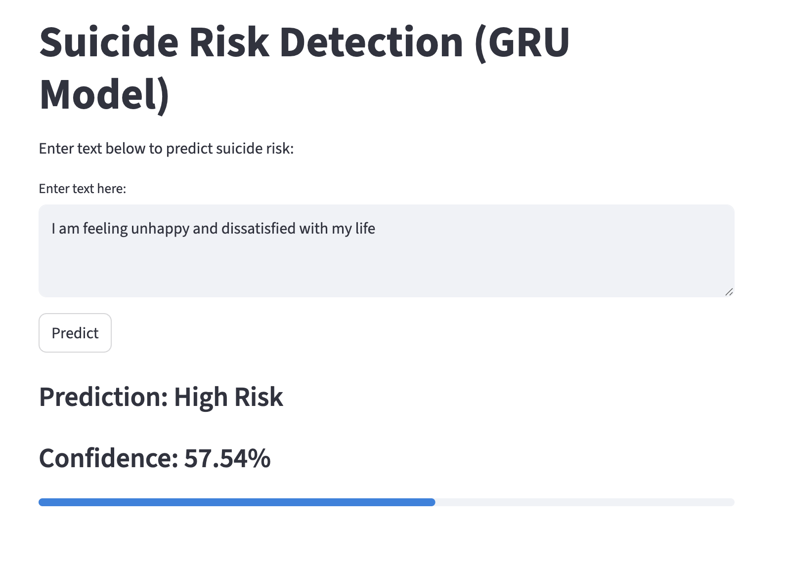

# Suicide detection project

Suicide is one of the leading causes of death worldwide, with millions at risk each year. Online communities, such as Reddit, have become outlets where individuals openly share struggles with depression and suicidal ideation. Detecting high-risk language in these posts can help researchers design **just-in-time interventions** and **support systems**. This project explores how **machine learning** and **deep learning** can be applied to social media data for **suicidal ideation detection**, while also emphasizing **explainability**.

## Dataset Information

The dataset includes posts from Reddit:
- **r/SuicideWatch** → labeled *suicide*
- **r/depression** → labeled *depression*
- **r/teenagers** → labeled *non-suicide*

Collected using the **Pushshift API**:  
- SuicideWatch: Dec 2008 – Jan 2021  
- Depression: Jan 2009 – Jan 2021  
- Teenagers: Control group  

Citation: [Suicide Ideation Detection in Social Media Forums (IEEE)](https://ieeexplore.ieee.org/document/9591887)

## Installation
Clone the repo and install dependencies:  

```bash
git clone https://github.com/yourusername/suicide_detection_project.git
cd suicide_detection_project
pip install -r requirements.txt

## Running the Streamlit App

To launch the suicide risk detection app locally:

```bash
streamlit run app.py

Below is an example of how the Streamlit app looks:


